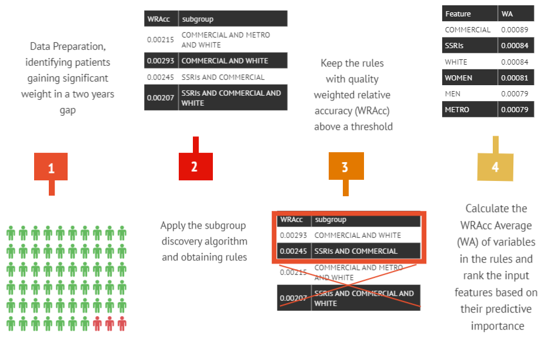

# rule-based-method-identifying-significant-weight-gain-factors

Here is an overview of the proposed procedure in order to discovering distinguished factors leading to significant weight gain in adults:

## Finding rules and their importance
First of all, the patients and visit level data from Atheana health aggregated and all the data one-hot encoded. For privacy issue, the data is omitted from the repository.

To apply subgroup discovery method to generate rules in two levels of medication(low-level) and visit(high-level) in the [main.py](main.py)
we can select one of the arrays (high-level or low-level) and run the code. In this step, rules are generated and a WRAcc score assign to each of them. This process runs in an experimental analysis setting with 9 different variables (containing different width for the beam search and maximum number of features in each rule). Also, we have run this experiment on 22 different strata in 6 different categories. In this code, the experiment have been applied on the all data (as you can notice in the name of the file that is going to be saved). To get the result for each of the stratum, we select data belonging to that stratum and ommit all the features related to that category and run the experiment in order to be more specific.

## Calculating the importance of each features
In the [quality_measure.py](quality_measure.py) file, first we use some conventional abbreviation for the long feature names in the dataset. Then try to keep rules with WRAcc quality higher than a threshold. WRAcc can be calculated as below:

where:

Then, the WRAcc Average (WA) for each feature appearing in the high quality rules calculated by the folmula below:

In the paper, WA of important features in each of 22 strata as well as all of the data in 9 different experimental setting (in order to show the robustness of method) demoonstrated. 
